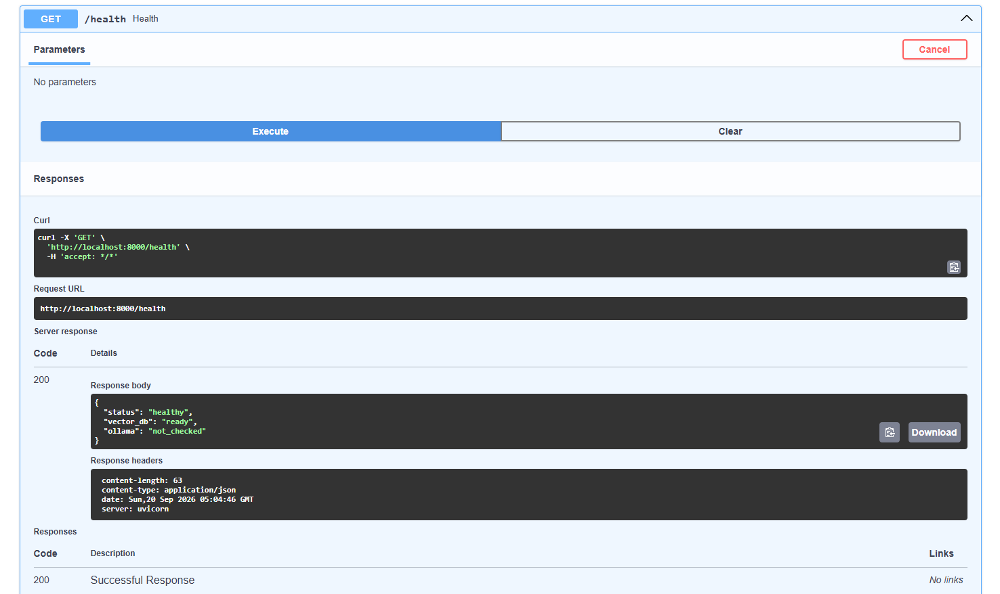
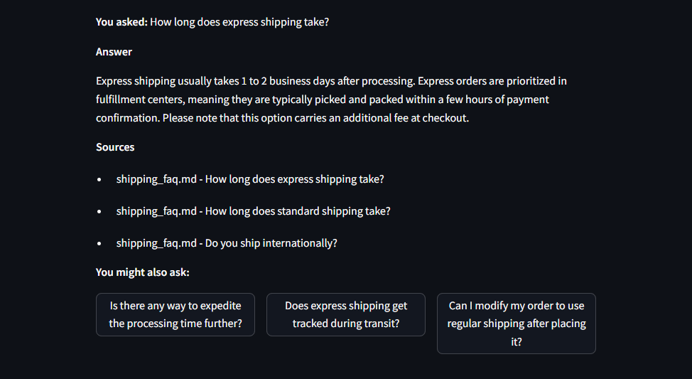
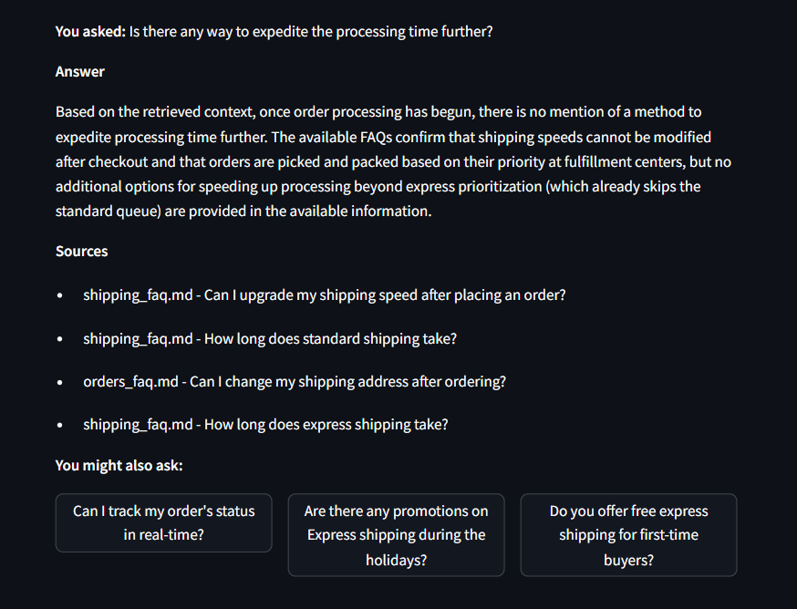
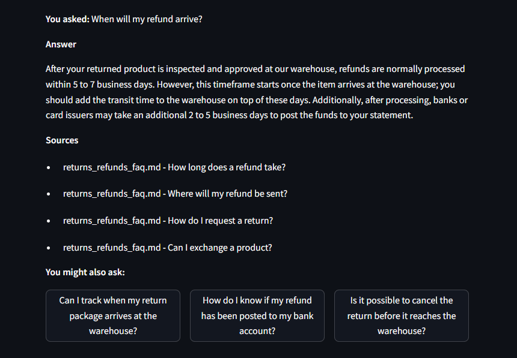
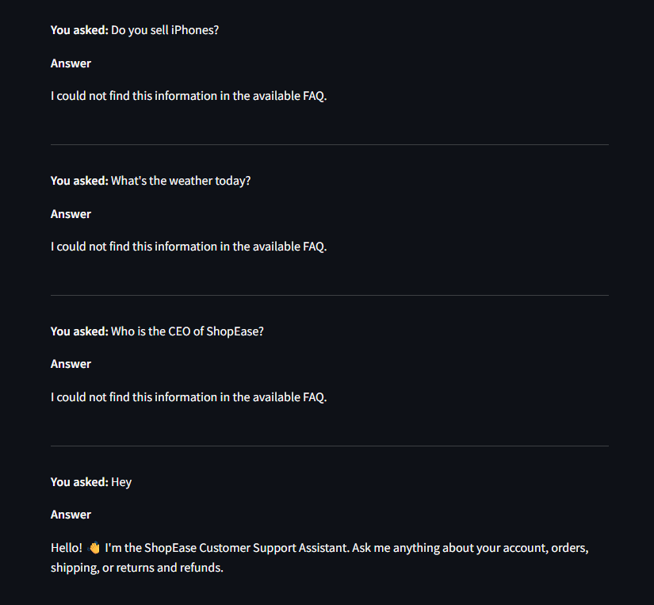

# ShopEase AI Customer Support RAG Assistant


-000000)


A production-minded **Retrieval-Augmented Generation (RAG)** application that answers e-commerce
customer-support questions by retrieving relevant FAQ content and generating a grounded answer with a
local Ollama LLM — never from the model's own general knowledge.

Built for the Level 2 Summer Training graduation project (Core Track — text-only RAG).

> This README documents not just what the system does, but the real engineering decisions,
> debugging process, and trade-offs made while building it end-to-end on local, CPU-only hardware.

---

## 1. Overview

**Domain:** Customer support FAQs for a fictional e-commerce company, **ShopEase**.

**Problem statement:** Customers ask repetitive questions about accounts, orders, shipping, and
returns/refunds. This assistant retrieves the exact FAQ entry relevant to a question and asks a local LLM
to answer strictly from that retrieved content, citing its source — so it never hallucinates policy details
that aren't in the knowledge base, and explicitly refuses when a question falls outside its knowledge.

---

## 2. What Makes This Implementation Stand Out

Beyond the baseline RAG pipeline, this project includes several features built and tested iteratively,
each addressing a real failure mode discovered through hands-on testing:

| Feature | Why it matters |
|---|---|
| **Two-layer grounding** | A fast, code-level distance-threshold check refuses clearly out-of-scope questions *instantly* (no LLM call needed), while the LLM's own strict prompt rules catch borderline cases as a second safety net. |
| **Empirically calibrated refusal threshold** | The 1.0 cutoff wasn't guessed — it was measured directly from this project's own embedding model output (see Section 8). |
| **Simple conversation memory** | Supports natural follow-ups ("does that include weekends?") by blending recent context into both the search step *and* the LLM prompt — but only as a fallback, so it never contaminates genuinely new, unrelated questions. |
| **Contextual follow-up suggestions** | After each answer, the assistant proposes 3 relevant next questions, generated live by the LLM based on the actual conversation. |
| **Greeting detection** | Small talk ("hi", "hello") is answered instantly without touching retrieval or the LLM at all — both faster and more natural than a strict FAQ-only refusal. |
| **19 automated tests** | 3 API-contract tests (the assignment's minimum) plus 16 additional unit tests covering grounding logic, refusal behavior, source de-duplication, and prompt/response parsing — all without needing a live Ollama instance or vector store. |
| **Root-caused, not just patched, performance issue** | Diagnosed and fixed a 10x+ response-time gap by disabling a local reasoning model's internal "thinking" step at the source, rather than only masking it with surface-level tuning (see Section 9.8). |

---

## 3. Architecture

```text
                         ┌─────────────────┐
                         │     User        │
                         └────────┬────────┘
                                  │
                                  ▼
                         ┌─────────────────┐
                         │   Streamlit     │
                         │    Frontend     │
                         └────────┬────────┘
                                  │ HTTP POST /query
                                  ▼
                         ┌─────────────────┐
                         │    FastAPI      │
                         │    Backend      │
                         └────────┬────────┘
                                  │
                         ┌────────▼────────┐
                         │ RAG Orchestrator│
                         │ (rag_pipeline.py)│
                         └───────┬───┬─────┘
                                 │   │
                   ┌─────────────┘   └──────────────┐
                   ▼                                ▼
          ┌─────────────────┐              ┌─────────────────┐
          │ Sentence        │              │ Chroma Vector   │
          │ Transformer     │              │ Database        │
          │ (query embed)   │              │ (persisted)     │
          └─────────────────┘              └────────┬────────┘
                                                     │ top-k chunks
                                                     │ + distance scores
                                                     ▼
                                   ┌───────────────────────────────┐
                                   │ Confidence check:              │
                                   │ best distance <= threshold?    │
                                   └───────┬─────────────┬─────────┘
                                       No   │             │  Yes
                              (skip LLM)    ▼             ▼
                                  ┌──────────────┐ ┌─────────────────┐
                                  │ Instant       │ │ Prompt Builder  │
                                  │ refusal       │ │ (+ history)     │
                                  └──────────────┘ └────────┬────────┘
                                                             │
                                                             ▼
                                                    ┌─────────────────┐
                                                    │ Ollama Local LLM│
                                                    │ (think=False)   │
                                                    └────────┬────────┘
                                                             │
                                                             ▼
                                          Grounded Answer + Sources + Follow-ups
```

### RAG workflow

```text
OFFLINE (notebook)                       ONLINE (FastAPI, per request)
===================                      ===============================
FAQ Documents                            User Question
   ↓                                        ↓
Load                                     Embed query
   ↓                                        ↓
Clean                                    Retrieve top-k chunks from Chroma
   ↓                                        ↓
Chunk (Q+A aware)                        Confidence check (distance threshold)
   ↓                                        ↓
Embed                                    Build grounded prompt (+ recent history)
   ↓                                        ↓
Store in Chroma                          Call Ollama (think disabled)
   ↓                                        ↓
Persist to data/vector_store/            Return answer + sources + follow-ups
```

The vector store is built **once**, offline, in the notebook, and persisted to disk. The FastAPI backend
loads it once at startup (`lifespan`) and never rebuilds it per request.

---

## 4. Technology Stack

| Layer            | Technology                                  |
|------------------|----------------------------------------------|
| Embeddings       | `sentence-transformers` (`all-MiniLM-L6-v2`) |
| Vector database  | `chromadb` (persistent client)               |
| LLM inference    | `ollama` (local; developed, tested, and demoed with `qwen3.5:4b`) |
| Backend          | `FastAPI`, `pydantic`, `pydantic-settings`   |
| Frontend         | `Streamlit`                                  |
| Testing          | `pytest`, `httpx` (FastAPI `TestClient`), `monkeypatch` |
| Notebook         | `Jupyter`, `pandas`                          |

---

## 5. Project Structure

```text
customer-support-rag/
│
├── notebooks/
│   └── rag_pipeline.ipynb        # offline pipeline: load → clean → chunk → embed → store → evaluate
│
├── data/
│   ├── documents/                # 4 source FAQ markdown files
│   │   ├── account_faq.md
│   │   ├── orders_faq.md
│   │   ├── shipping_faq.md
│   │   └── returns_refunds_faq.md
│   └── vector_store/              # persisted Chroma DB (produced by the notebook, not committed)
│
├── backend/
│   ├── app/
│   │   ├── main.py                # FastAPI app, CORS, lifespan startup
│   │   ├── api/routes/query.py    # POST /query, GET /health
│   │   ├── core/config.py         # pydantic-settings configuration
│   │   ├── schemas/query.py       # QueryRequest / QueryResponse / ChatTurn
│   │   ├── services/
│   │   │   ├── retrieval.py       # load Chroma, embed query, retrieve top-k
│   │   │   ├── generation.py      # build grounded prompt, call Ollama, suggest follow-ups
│   │   │   └── rag_pipeline.py    # orchestrates retrieval + confidence check + generation
│   │   └── utils/logging_config.py
│   ├── tests/
│   │   ├── test_query.py          # API-contract tests (happy path + validation)
│   │   ├── test_rag_pipeline.py   # unit tests: greeting detection, refusal, source de-dup
│   │   └── test_generation.py     # unit tests: prompt building, response parsing
│   ├── requirements.txt
│   ├── .env.example
│   └── Dockerfile
│
├── frontend/
│   ├── app.py                     # Streamlit chat UI (memory, suggestions, Enter-to-submit)
│   ├── api_client.py              # backend HTTP wrapper (reads API_BASE_URL)
│   ├── .env.example
│   └── requirements.txt
│
├── docs/
│   └── screenshots/                # README screenshots
│
├── .gitignore
├── README.md
└── requirements.txt
```

---

## 6. Domain & Data

Four synthetic-but-realistic FAQ documents for a fictional company, **ShopEase**, covering:

- **Account** — signup, password reset, security, privacy, rewards
- **Orders** — placing/cancelling orders, payments, promo codes, order status
- **Shipping** — delivery times, costs, tracking, carriers, international shipping
- **Returns & Refunds** — return windows, refund timing, exchanges, damaged items

Each file uses one `## Question` header per FAQ entry. A subset of the highest-traffic entries (shipping
times, cancellations, refunds, password reset, etc.) were deliberately expanded with richer, multi-sentence
answers — partly for realism, and partly as a deliberate technical stress-test: longer answers exceed the
600-character chunk size, which forces the chunking code's fixed-size, overlap-based splitting path to
actually run, rather than every chunk trivially being one short Q+A pair.

---

## 7. Setup & Installation

### Prerequisites

```bash
python --version   # 3.10+
ollama --version
git --version
```

### 1. Clone and create a virtual environment

```bash
git clone https://github.com/<your-username>/customer-support-rag.git
cd customer-support-rag
python -m venv .venv
source .venv/bin/activate   # Windows: .venv\Scripts\activate
pip install -r requirements.txt
```

### 2. Pull an Ollama model

```bash
ollama pull qwen3.5:4b
ollama serve   # if not already running
```

This project was developed, tested, and demoed with `qwen3.5:4b`. Any locally installed Ollama model can be
used instead by setting `OLLAMA_MODEL` in `backend/.env` to match — but note that the `think=False` speed
optimization described in Section 9.8 is specific to reasoning-capable models like `qwen3.5`; it is silently
ignored (harmlessly) by non-reasoning models such as `llama3.2`, which never exhibited the slowdown it fixes
in the first place.

### 3. Run the notebook (builds the vector store)

```bash
jupyter notebook notebooks/rag_pipeline.ipynb
```

Run **Kernel → Restart & Run All**. This produces `data/vector_store/` containing the persisted Chroma
collection and a `pipeline_config.json` snapshot.

> **Important:** any time the notebook is re-run, the vector store is deleted and rebuilt from scratch
> with a new internal ID. If the backend is already running, it will crash on the next query with a
> `Collection does not exist` error until it's restarted — **always restart the backend after re-running
> the notebook.**

### 4. Run the backend

```bash
cd backend
cp .env.example .env        # edit OLLAMA_MODEL and VECTOR_DB_PATH if needed
pip install -r requirements.txt
uvicorn app.main:app --reload
```

Open `http://localhost:8000/docs` and try `POST /query` from Swagger UI.

### 5. Run the frontend

```bash
cd frontend
cp .env.example .env
pip install -r requirements.txt
streamlit run app.py
```

Open the URL Streamlit prints (default `http://localhost:8501`). Type a question and press **Enter** or
click **Ask Question**.

### 6. Run tests

```bash
cd backend
pytest
```

All 19 tests should pass in a few seconds — none require a live Ollama instance or a built vector store.

---

## 8. Evaluation Results

The notebook (Section 6) runs 15 in-scope questions across all four FAQ categories plus 2 intentionally
out-of-scope questions, recording expected source, retrieved source, and grounding correctness for each,
saved to `data/vector_store/evaluation_results.csv`.

**The automatic refusal threshold (1.0) was not guessed — it was measured directly:**

| | Minimum distance | Maximum distance |
|---|---|---|
| **In-scope questions** (15 samples) | 0.373 | 0.858 |
| **Out-of-scope questions** (2 samples) | 1.153 | 1.329 |

There is a clean separation between the two groups, so `1.0` was chosen as a safe cutoff roughly in the
middle. Any retrieved chunk with a distance above this is refused **before the LLM is even called** —
making refusals both instant and independent of the LLM's own judgment.

Out-of-scope questions tested live (in addition to the notebook set) include *"Who is the CEO of
ShopEase?"*, *"Can I pay using cryptocurrency?"*, *"Do you sell iPhones?"*, and *"What's the weather
today?"* — all correctly refused with `"I could not find this information in the available FAQ."`

---

## 9. Development Journey: Real Problems Encountered and How They Were Solved

This section documents the actual debugging process during development — kept here deliberately, because
each issue reveals something real about how local LLM/RAG systems behave in practice, beyond what any
tutorial covers.

### 9.1 Windows build failure installing `chromadb`

**Problem:** `pip install` failed compiling `chroma-hnswlib` from source, requiring Microsoft's C++ Build
Tools (a multi-GB Windows-only dependency).
**Solution:** Rather than requiring every user to install a large compiler toolchain, the `chromadb`
version pin in `requirements.txt` was loosened, allowing pip to install a newer version that ships a
pre-built wheel for Windows — avoiding compilation entirely.
**Trade-off:** `requirements.txt` pins slightly looser version ranges for this dependency than for others,
in exchange for a dramatically simpler setup experience on Windows.

### 9.2 Accidental installation into the global Python environment

**Problem:** A virtual environment was created, but a dependency install was accidentally run before it
was activated, silently upgrading/downgrading unrelated packages (`tensorflow`, `langchain`, etc.) in the
system-wide Python installation.
**Solution:** The exact previous versions were captured from `pip list` output and explicitly reinstalled
to restore the global environment, and virtual-environment activation is now verified (checking for the
`(.venv)` prompt prefix) before every subsequent install.
**Lesson:** This is precisely why Python virtual environments exist — this project's dependencies never
need to touch the system Python at all when the environment is activated correctly.

### 9.3 Vector store path resolution mismatch

**Problem:** The backend crashed on startup, unable to find the vector store, because `VECTOR_DB_PATH` in
`.env` was a relative path (`data/vector_store`) — correct when the notebook writes it from
`notebooks/../data/vector_store`, but wrong when the backend is launched from inside `backend/`, since
relative paths resolve against the current working directory.
**Solution:** Updated `VECTOR_DB_PATH` to `../data/vector_store` to correctly resolve from the backend's
own working directory.

### 9.4 Stale Chroma collection reference after notebook re-runs

**Problem:** Since the notebook deletes and recreates the Chroma collection on every run (for
idempotency), a backend process started *before* a notebook re-run holds an in-memory reference to a
collection ID that no longer exists on disk, causing `chromadb.errors.NotFoundError` on the next query.
**Solution:** No code fix was appropriate here — this is a documented operational rule for anyone using
this project: **restart the backend after any notebook re-run.** This is called out explicitly in Section
7 above.

### 9.5 "Thinking" model returning empty responses under a token cap

**Problem:** To speed up local CPU inference, response length was capped (`num_predict`). The specific
model used (`qwen3.5:4b`) is a *reasoning* model that spends part of its output budget on internal,
invisible "thinking" tokens before writing its visible answer. When the cap was too tight, the model
exhausted its entire budget thinking and never wrote a visible answer — returning an empty string, which
the code originally (incorrectly) treated as "the answer isn't in the FAQ."
**Solution:** The code no longer conflates "empty response" with "not grounded" — it returns a distinct,
honest message (`"Sorry, I had trouble generating an answer just now."`) instead of the misleading refusal
text. The token cap itself was later made unnecessary entirely by the real fix in Section 9.8.

### 9.6 Conversation-history blending contaminating unrelated follow-up questions

**Problem:** To support natural follow-ups ("does that include weekends?"), the search query was blended
with the previous question. This worked for genuine follow-ups, but broke when the user simply switched to
a completely new, unrelated topic right after a previous question — the old topic's wording was still
polluting the new search, occasionally pushing the retrieval distance above the refusal threshold for
otherwise easy, well-supported questions.
**Solution:** Retrieval now attempts the question exactly as typed *first*. Only if that alone fails to
find a confident match does it retry once, blended with the previous question, as a fallback — rescuing
genuine follow-ups without contaminating standalone new questions.

### 9.7 Response-speed vs. context-richness trade-off

**Problem:** Local CPU inference made each response slow, made worse once follow-up-suggestion generation
added a second sequential LLM call per question. Reducing `top_k` (the number of FAQ chunks retrieved per
question) from 4 to 2 was tested as a way to cut response time by giving the LLM less context to process.
**Decision:** After direct comparison, `top_k` was kept at **4**. While `top_k=2` was measurably faster at
the time, testing showed it occasionally caused very short, ambiguous single-word queries (e.g.
*"Refund?"*) to retrieve a less representative pair of chunks, producing a technically-grounded but less
broadly relevant answer.
**Trade-off accepted and documented:** For a customer-support assistant, answer breadth and reliability
were judged more important than shaving a few seconds off response time, so `top_k=4` was kept as the final
setting. This decision was later validated further: once the real performance bottleneck was fixed at its
source (Section 9.8), keeping the richer `top_k=4` context stopped costing any meaningful speed at all.

### 9.8 The real fix: disabling internal "thinking" via Ollama's official `think` parameter

**Problem:** Even after removing response-length caps (Section 9.5) and considering reduced retrieved
context (Section 9.7), responses still consistently took 60–100+ seconds — while a friend's separate RAG
project, using the exact same `qwen3.5:4b` model, responded in under 10 seconds.

**Investigation:** Comparing the two projects' code directly (rather than continuing to guess) revealed the
actual difference: the friend's `ollama.chat()` call explicitly passed `think=False`, Ollama's official,
supported setting for disabling a reasoning model's internal chain-of-thought generation entirely. This
project's originally pinned `ollama` Python package version (`0.3.3`) predated support for that parameter,
so it was silently unavailable — meaning every single request was paying for a full internal "thinking"
pass that was never actually needed for this use case.

**Solution:** Upgraded the `ollama` package and added `think=False` to every Ollama call in
`generation.py`.

**Result:** Response times dropped from 60–100+ seconds to a few seconds per question — the single largest
performance improvement in the whole project, and the correct, root-cause fix for a problem that earlier,
more surface-level attempts (capping response length, reducing `top_k`) could only partially work around.

---

## 10. API Reference

### `POST /query`

Request:

```json
{
  "question": "How long does standard shipping take?",
  "top_k": 4,
  "history": [
    {"question": "How long does a refund take?", "answer": "5 to 7 business days."}
  ]
}
```

`top_k` and `history` are both optional.

Response:

```json
{
  "answer": "Standard shipping usually takes 3 to 5 business days after processing.",
  "sources": ["shipping_faq.md - How long does standard shipping take?"],
  "suggested_questions": [
    "How long does express shipping take?",
    "Do you ship internationally?",
    "How much does standard shipping cost?"
  ]
}
```

`curl` example:

```bash
curl -X POST http://localhost:8000/query \
  -H "Content-Type: application/json" \
  -d '{"question": "Can I cancel my order after payment?"}'
```

### `GET /health`

```bash
curl http://localhost:8000/health
```

```json
{ "status": "healthy", "vector_db": "ready", "ollama": "not_checked" }
```

`ollama` intentionally reports `"not_checked"` rather than pinging the LLM on every health check — a
health/heartbeat endpoint is meant to be fast and lightweight, and coupling it to a live LLM round-trip
would make simple uptime monitoring slower and dependent on Ollama's availability. A deeper, optional health
check that does verify Ollama connectivity is listed as a future improvement (Section 13).

---

## 11. Screenshots

### API Health Check (`/docs`)

Confirms the backend successfully loaded the persisted vector store on startup, before any question is asked.



### Standard FAQ Retrieval with AI-Generated Follow-up Suggestions

A normal question, answered correctly with its source cited, plus 3 follow-up questions generated live by
the LLM based on the conversation ("You might also ask").



### Multi-turn Follow-up Flow

Clicking one of the suggested follow-ups above continues the conversation naturally. Notice the assistant
correctly states that a specific detail ("expediting processing time further") isn't covered in the FAQ,
rather than guessing — grounding holds even mid-conversation.



### Semantic Vector Search in Action

The question ("When will my refund arrive?") uses completely different wording than the FAQ's own phrasing
("How long does a refund take?") — demonstrating that retrieval matches on *meaning*, not just keyword
overlap.



### Guardrails: Refusing Out-of-Scope Questions, and Handling Greetings

Four consecutive questions in one session: three genuinely out-of-scope questions ("Do you sell iPhones?",
weather, the company's CEO) are correctly refused instead of hallucinated, and a casual greeting ("Hey") is
answered naturally instead of being treated as a failed FAQ lookup.



---

## 12. Known Limitations

- `top_k=2` was tested as a speed optimization and did measurably reduce response time at the time, but
  occasionally produced less representative answers on short, ambiguous queries (e.g. *"Refund?"*) — this
  is why `top_k=4` was kept as the final setting (see Section 9.7). This is no longer a meaningful speed
  trade-off after the fix in Section 9.8.
- The knowledge base is synthetic; it does not reflect a real company's actual policies.
- No authentication or rate-limiting is implemented — not intended for public production traffic as-is.
- Follow-up-question suggestions add a second sequential LLM call, which does add some response time; this
  was accepted as a worthwhile UX trade-off given how fast each individual call now is (Section 9.8).
- The `/health` endpoint does not verify live Ollama connectivity by design (see Section 10) — a
  `vector_db: ready` status does not guarantee Ollama itself is reachable.

## 13. Future Improvements

- Add hybrid search (combining keyword/BM25 matching with vector similarity) or a lightweight reranking
  step on top of the current retrieval, to further improve relevance for very short or ambiguous queries.
- Add an optional "deep" health check variant that verifies live Ollama connectivity, separate from the
  current fast, lightweight `/health` endpoint.
- Add streaming responses from Ollama to the Streamlit UI so partial answers appear as they're generated.
- Containerize the frontend and backend together with Docker Compose for one-command startup (the backend
  already has a working `Dockerfile`).

---

## 14. Reproducing From Scratch (stranger test)

```bash
git clone <repo-url>
cd customer-support-rag
python -m venv .venv && source .venv/bin/activate
pip install -r requirements.txt
ollama pull qwen3.5:4b
jupyter notebook notebooks/rag_pipeline.ipynb   # Kernel -> Restart & Run All
cd backend && cp .env.example .env && uvicorn app.main:app --reload &
cd ../frontend && cp .env.example .env && streamlit run app.py
```

## 15. Teams

- Ahmed Fawzy Elsayed Elsayed
- Hatem Fawzy Elsayed Elsayed
